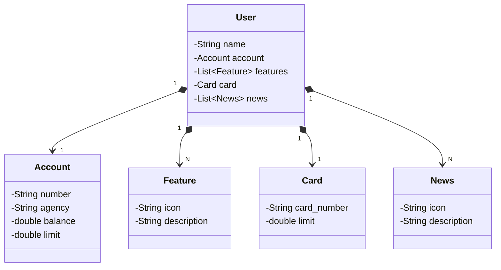

Estudando junto com a galera da DIO, aprendendo a como criar uma API RESTful com a linguagem Java
Também faremos outras coisas muito legais por aqui. Aguardo o desafio de criar a minha própria API
com base nesses estudos.

Segue o Diagrama de classes que irei me basear para a devida criação da API

Aqui está o diagrama de classes em sintaxe Mermaid baseado no JSON fornecido:

## Diagrama de Classes

